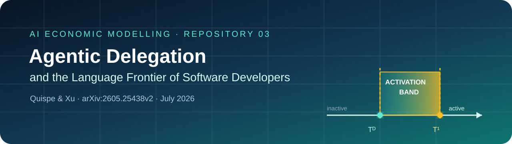

<p align="center">
  
</p>

<p align="center">
  <a href="paper/quispe-xu-2026.pdf"></a>
  <a href="https://doi.org/10.48550/arXiv.2605.25438"></a>
  <a href="presentation.pdf"></a>
  <a href="presentation.tex"></a>
  <a href="analysis/symbolic_check.py"></a>
  <a href="lean/README.md"></a>
  <a href="LICENSE.md"></a>
</p>

<p align="center">
  
  
  
  
  
</p>

# Delegación agéntica y la frontera de lenguajes

> **Cita verificada.** Quispe, Alexander, y Kevin Xu. 2026. “Agentic Delegation and the Language Frontier of Software Developers: A Model and Evidence from Claude Code on GitHub.” Preprint de *arXiv* arXiv:2605.25438v2, 8 de julio de 2026. <https://doi.org/10.48550/arXiv.2605.25438>.

**Corrección de estado.** Es un preprint de economía en **arXiv**, preliminar y no arbitrado, no un working paper del NBER. La versión 1 se envió el 25 de mayo de 2026; la versión 2 se publicó el 7 de julio y el PDF lleva fecha del 8 de julio. La versión anterior circuló como *Coding Beyond Your Training: Claude Code and the Technological Frontier of Software Developers* y figuraba solo con Alexander Quispe. El paper actual tiene dos autores: **Alexander Quispe y Kevin Xu**.

**Estado de la formalización.** La corrida obligatoria de EconCSLib generó la carpeta completa `QX26AgenticDelegation`. Los cinco endpoints de teorema seleccionados compilan sin `sorry`; `lake build QX26AgenticDelegation` pasó con 8,318 jobs y el chequeo rápido oficial de contribución también pasó. Siendo honestos con el protocolo, el estado sigue siendo **parcialmente formalizado**, porque faltan las revisiones independientes de fidelidad a la fuente de EconCSLib y la firma humana en el dashboard. Ver el [reporte de validación](lean/FINAL_VALIDATION_REPORT.md).

## La pregunta y el mecanismo único

¿La IA agéntica amplía el conjunto de lenguajes de programación en los que un desarrollador puede entregar código que funciona, y no solo lo vuelve más rápido en los lenguajes que ya conoce?

El mecanismo único es que **la delegación baja un umbral de entrada específico de cada lenguaje**. La asistencia conversacional exige suficiente habilidad en el lenguaje para leer e integrar las sugerencias. Un agente, en cambio, puede ejecutar a partir de una especificación en lenguaje natural mientras el desarrollador especifica, descompone y verifica. Eso puede volver rentable un proyecto en un lenguaje desconocido sin que el desarrollador haya aprendido ese lenguaje.

El modelo separa tres capacidades de producción:

1. **Solo:** el desarrollador ejecuta con su habilidad específica en el lenguaje.
2. **Aumentación:** un asistente conversacional agrega sugerencias en proporción a la habilidad existente.
3. **Delegación:** un agente ejecuta una parte de la tarea, apoyándose en la capacidad general del desarrollador para especificar y verificar.

## El problema del desarrollador

Para el desarrollador $i$, el lenguaje $k$ y el mes $t$, el desarrollador observa el valor de oportunidad $\omega_{ikt}$ y elige el mejor modo disponible. Antes de adoptar el agente el menú es $M^1=\{S,C\}$; después es $M^2=\{S,C,D\}$:

```math
V^g_{ikt}=\max_{m\in M^g}V^m_{ikt},\qquad
Z^g_{ikt}=\mathbf 1\{V^g_{ikt}\ge 0\}.
```

El lenguaje se usa solo si su mejor excedente en equivalente de certeza es no negativo. Los pagos combinan el valor de oportunidad, el costo de activación, la habilidad específica en el lenguaje, la calidad incierta del match, la capacidad general, la competencia de la IA, los costos de verificación y cómputo, y el riesgo. **En el modelo central del paper no hay elección continua de esfuerzo.** Llamarlo un “problema de esfuerzo” importaría otro modelo; aquí la elección es discreta: selección de modo y entrada.

## Resultados teóricos principales

Para un lenguaje desconocido, el Supuesto 1 dice que la aumentación conversacional no mejora el margen de entrada, así que $T^1=T^S$. La delegación tiene umbral $T^D$, y su ventaja es $B=T^S-T^D$.

**Proposición 1 (expansión débil de la frontera).** Agregar delegación no puede quitar una opción:

```math
M^1\subset M^2 \quad\Longrightarrow\quad Z^2_{ikt}\ge Z^1_{ikt},\qquad N^2_{it}\ge N^1_{it}.
```

**Proposición 2 (banda de activación).** Si el lenguaje es desconocido, la aumentación necesita un punto de apoyo y la delegación baja estrictamente su umbral ($B>0$), entonces:

```math
Z^2_{ikt}-Z^1_{ikt}=\mathbf 1\{T^D_{ikt}\le\omega_{ikt}<T^1_{ikt}\}.
```

Es decir, el agente activa las oportunidades del medio: demasiado débiles para producción solo o conversacional, pero suficientes bajo delegación. Con una CDF condicional continua $F$, la probabilidad de activación por lenguaje es $F(T^1)-F(T^D)$.

**Proposición 3 (implicación de stock y flujo).** Si el hazard de primer uso por período es débilmente mayor bajo delegación, $p^2_{ik}\ge p^1_{ik}$, el efecto acumulado esperado sobre los lenguajes es no negativo. En el benchmark de frontera cerrada $p^1_{ik}=0<p^2_{ik}$, crece de forma estricta y cóncava a lo largo del horizonte observado. Por eso los primeros usos pueden dispararse y revertir mientras la amplitud acumulada sigue subiendo.

El álgebra de umbrales más larga, la fórmula dinámica, los supuestos y la salvedad en los extremos del dominio están en [`extensions.md`](extensions.md).

## Datos y diseño empírico

El panel balanceado va de **enero de 2024 a abril de 2026 (28 meses)**. El panel inicial tiene 5,825 desarrolladores; tras exigir actividad previa a la adopción y excluir a usuarios detectables de agentes competidores, la muestra de estimación es:

| Objeto | Tamaño |
|---|---:|
| Desarrolladores | **5,346** |
| Tratados / controles not-yet-treated | **2,813 / 2,533** |
| Observaciones desarrollador-mes | **149,688** |
| Commits reconstruidos | **3.2 millones** |
| Pares desarrollador–repositorio | **133,000** |
| Archivos modificados clasificados con GitHub Linguist | **57 millones** |
| Commits con coautoría de Claude en el universo de detección | **7.8 millones** |

La adopción es el primer commit con un trailer de coautoría de Claude legible por máquina. El paper estima event studies de adopción escalonada de Callaway–Sant’Anna, doblemente robustos, usando desarrolladores not-yet-treated, un mes de anticipación, períodos base variables y 1,000 iteraciones de bootstrap multiplicador agrupadas por desarrollador.

## Resultados empíricos principales

En la adopción ($e=0$):

| Resultado | Estimación | EE bootstrap | Punto de referencia |
|---|---:|---:|---|
| Lenguajes de programación activos | **+2.528** | 0.063 | media pre-adopción 0.90 |
| Lenguajes usados por primera vez | **+1.193** | 0.051 | flujo mensual pre-adopción 0.31 |
| Entropía de lenguajes | **+0.382** | 0.009 | media pre-adopción 0.15 |
| Lenguajes acumulados | **+1.604** | 0.054 | sube a 1.892 en $e=1$, 2.072 en $e=2$ |
| Repositorios | **+1.494** | 0.058 | diagnóstico de actividad |
| Commits mensuales | **+35.080** | 2.085 | diagnóstico de actividad |

Los lenguajes activos siguen más altos en $e=1$ (**+1.227**, EE 0.064) y $e=2$ (**+0.693**, EE 0.067). Los lenguajes usados por primera vez caen a **+0.126** (EE 0.034) en $e=1$ y son estadísticamente indistinguibles de cero en $e=2$, lo que calza con el patrón de flujo frente a stock que predice el modelo. Entre los desarrolladores de alta capacidad, los especialistas agregan **0.981** lenguajes nuevos en la adopción frente a **0.301** de los generalistas; entre los de baja capacidad la comparación es **2.388** frente a **1.015**.

Los resultados sobreviven a quitar el primer lenguaje usado con Claude, excluir todo commit con coautoría de Claude, condicionar por actividad, aplicar filtros de actividad más estrictos y descartar agentes competidores. El resultado acumulado tiene pre-tendencias significativas, así que los autores hacen bien en tratarlo como descriptivo y no como evidencia causal de titular.

## Conclusión económica y límite de identificación

La evidencia es consistente con que la IA agéntica amplía la **frontera de producción** de un desarrollador: la capacidad general para especificar y verificar puede desplegarse entre lenguajes incluso cuando la habilidad de ejecución específica es baja. La ventaja comparativa de los generalistas en razonamiento podría, por tanto, volverse aprovechable en dominios que antes quedaban bloqueados por costos de implementación especializada.

Esto **no** es evidencia de que los desarrolladores adquieran habilidad en el lenguaje, ni es un efecto causal definitivo. La adopción es voluntaria y puede coincidir con un shock de proyecto en un lenguaje desconocido. Las estimaciones son asociaciones en tiempo de evento; su patrón por especialistas y sus chequeos de robustez respaldan el mecanismo de delegación, aunque no lo identifican.

## Mapa del repositorio

```text
ai-03-quispe/
├── README.md
├── assets/banner.svg
├── analysis/symbolic_check.py
├── extensions.md
├── hand/README.md
├── lean/                         # salida completa de EconCSLib QX26AgenticDelegation (5/5 pruebas)
├── paper/quispe-xu-2026.pdf
├── presentation.tex/.pdf        # deck de 20 minutos
├── prompts.md
└── LICENSE.md
```

Falta que el estudiante agregue después **su propia foto manuscrita** en `hand/`; ningún sustituto generado cuenta.
